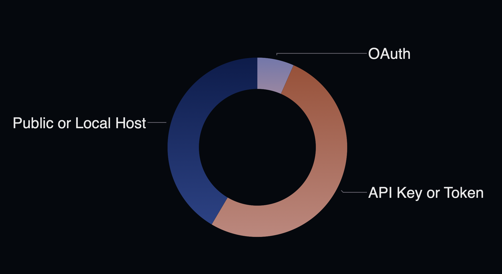

# Let Auth be Auth
_or: How I Learned to Stop Worrying and Let Someone Else Handle It_


## Part 1. How do you secure a server?

Everyone is building MCP servers, but how are they making them secure?



People love API keys because they're simple. Problem is, non-devs don't get them, they don't let you connect to cool stuff like Claude, and they're a nightmare to sell into enterprises with actual security requirements (and people with job titles like "Compliance Officer").


## Part 2. "I'll just build my own auth!" (Famous last words)

If you really want to go down this path, I've made it easy for you: check out the [custom auth instructions](./CUSTOM_AUTH.md) (generated by Claude, who has never had to pass a security audit).

But seriously—this is hard. We have a team working day and night to make AuthKit and enterprise connections bug-free. You don't want this life.


## Part 3. What's the easy route?

Since MCP uses dynamic client registration, you need to set up:
- `/.well-known/oauth-protected-resource`
- `/.well-known/oauth-authorization-server`

You'll also need a callback so OAuth has somewhere to send its love notes:
- `/callback`

Which can be as simple as:
```tsx
import { handleAuth } from "@workos-inc/authkit-nextjs";
export const GET = handleAuth();
```

And then you can wrap your MCP server in AuthKit like a warm security blanket:

```tsx
import { withAuthkit } from "@/lib/with-authkit";
import createMcpHandler from "@vercel/mcp-adapter/next";

const handler =
    withAuthkit((request, auth) => // 👈 This line is where the auth magic happens!
    createMcpHandler((server) => {
      server.tool(
        // ...
      );
    })
  );
```


## Part 4. Where next?

You can do all the usual permission enforcement:
```tsx
// Permission-restricted tools
if (auth.user.permissions?.includes("shop_purchase")) {
  server.tool(
    "buyMcpShopItem",
    // ...
  );
}
```

But here's the kicker: this also gets you ready to eventually sell into the enterprise. You know, those places with acronyms like SSO, SAML, SCIM, and more security compliance checkboxes than a government form.


## The Bottom Line

Stop reinventing the authentication wheel. It's 2025. We have better wheels now. They come with OAuth support, enterprise features, and most importantly, someone else maintains them.

Let auth be auth. Let someone else lose sleep over security vulnerabilities. You've got MCP servers to build.
